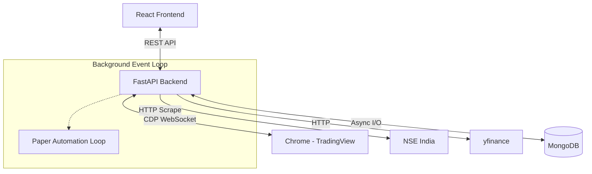

# AI Project Knowledge Base: Trading Agent

This document is specifically designed for another AI Developer (ChatGPT, Claude, Gemini, etc.) to quickly onboard and achieve expert-level mastery over this codebase. Do not rely on end-user documentation; read this document for architecture, algorithms, execution flows, and extension patterns.

---

## 1. Project Purpose

- **Why this project exists**: To automate technical analysis, market scanning, and execution (currently paper-trading) for the Indian Stock Market (NSE). It replaces manual chart screening and emotional trading with a strict, algorithmic pipeline.
- **Business goals**: Forward-test Swing and Momentum strategies without risking real capital, collect historical AI training data, and eventually transition to live brokerage execution.
- **User workflow**: 
  1. User clicks "Score Market Data" on the React UI.
  2. The system fetches real-time quotes for 750 NSE stocks, scores them, and identifies Swing/Momentum candidates.
  3. User reviews high-scoring stocks and clicks "Confirm via TradingView".
  4. The backend drives a local Chrome instance to extract chart data, calculates ATR/Stop-loss, and generates a Paper Trade Plan.
  5. User accepts the plan, and background schedulers automatically track it to targets or stop losses.

---

## 2. Complete Architecture

The project uses a decoupled Client-Server architecture.

### Modules:
1. **Frontend (React 18 + Vite)**: A monolithic dashboard (`App.jsx`) polling REST APIs. Responsible for visualizing data and triggering scans.
2. **Backend API (FastAPI)**: Python server running on `uvicorn`. Handles routing, HTTP validation, and orchestration.
3. **Data Providers Layer**: `nse_client.py` and `data_provider.py`. Responsible for scraping NSE indices and using `yfinance` as a fallback.
4. **Scoring Engine**: `scoring.py`. Pure, stateless math functions that grade stocks based on price proximity to highs/lows and relative volume.
5. **TradingView CDP Automation**: `tv_client.py`, `tv_confirmation.py`, and `tradingview_manager.py`. The backend connects to Google Chrome via WebSocket (Chrome DevTools Protocol - Port 9222). It manipulates the DOM and JavaScript context of TradingView to extract OHLCV and indicator data.
6. **Automation Schedulers**: Background tasks (`paper_automation.py`) running within the FastAPI event loop to track paper trades against real-time prices.
7. **Database (MongoDB + Motor)**: Stores historical market data, trade states, and AI dataset snapshots.

### Communication:
- React ↔ FastAPI: REST (JSON).
- FastAPI ↔ MongoDB: Async Motor driver.
- FastAPI ↔ Chrome: WebSocket via CDP (`ws://127.0.0.1:9222`).
- FastAPI ↔ NSE/Yahoo: HTTP GET requests.

---

## 3. Folder-by-Folder Explanation

### `backend/`
- **Purpose**: Core application server.
- **Responsibilities**: Web serving, database I/O, scoring logic, browser automation.
- **Dependencies**: FastAPI, Motor, aiohttp, requests, websockets.
- **Files inside**: `main.py`, `config.py`, `database.py`, `scoring.py`, `tv_client.py`, `nse_client.py`.

### `backend/routes/`
- **Purpose**: Defines API endpoints.
- **Files inside**: `scan.py` (market data), `score.py` (applying math), `paper.py` (trade management), `swing.py`, `momentum.py`, `health.py`.

### `backend/services/`
- **Purpose**: Heavy lifting business logic detached from HTTP contexts.
- **Files inside**: `tradingview_manager.py` (CDP lock management), `paper_automation.py` (schedulers), `pipeline_run_lock.py` (concurrency limits).

### `backend/tests/`
- **Purpose**: Pytest suite for critical validation (mostly logic, provider mocks).

### `frontend/src/`
- **Purpose**: React UI application.
- **Files inside**: `App.jsx` (entire UI routing & state), `api.js` (fetch definitions), `aiDataset.js` (helpers), `App.css`.

---

## 4. File-by-File Documentation

### `backend/main.py`
- **Purpose**: Application entry point.
- **Responsibilities**: Initializes FastAPI, handles CORS, mounts routers, manages the application `lifespan` (starts schedulers).
- **Global Configuration**: Disables strict route slashes.

### `backend/config.py`
- **Purpose**: Environment configuration validation.
- **Classes**: `Settings(BaseSettings)`.
- **Configuration**: Loads `.env`, casts types (e.g. `PAPER_MODE`, `LIVE_TRADING_ENABLED`, `TRADINGVIEW_DEBUG_PORT`).

### `backend/database.py`
- **Purpose**: Singleton connection manager for MongoDB.
- **Functions**: `get_database()`, `connect_to_mongo()`, `close_mongo_connection()`.

### `backend/scoring.py`
- **Purpose**: The math heart of the strategy.
- **Functions**: `score_market_data_row()`, `score_swing_row()`, `score_momentum_row()`.
- **Side effects**: None (pure functions).

### `backend/tv_client.py`
- **Purpose**: Raw CDP client.
- **Classes**: `TradingViewClient`.
- **Responsibilities**: Finding tabs, sending JSON-RPC payloads, injecting `window.TradingViewApi.activeChart().exportData()`.
- **Error Handling**: Hard timeouts on DOM ready events.

### `backend/tv_confirmation.py`
- **Purpose**: Verifies chart data and applies stop-loss models.
- **Functions**: `swing_tv_confirmation()`, `momentum_tv_confirmation()`.
- **Logic**: Validates timestamps, calculates ATR, determines Take Profit (R-multiples).

### `backend/data_provider.py` & `backend/nse_client.py`
- **Purpose**: Scrape the NSE index and handle fallbacks.
- **Algorithm**: Try NSE API -> Extract components -> If NSE fails or rate-limits -> Use yfinance for identical symbol names.

### `frontend/src/App.jsx`
- **Purpose**: Renders the UI.
- **State**: Uses `useState` and `useMemo` for dashboard tabs. Polling is heavily utilized for status updates.

### `frontend/src/api.js`
- **Purpose**: Abstraction for all HTTP requests to `localhost:8011`.

---

## 5. Function Documentation

### `score_market_data_row(row: dict) -> dict` (in `scoring.py`)
- **Purpose**: Generates sub-scores and final grades for a stock.
- **Inputs**: Raw OHLCV row (dict).
- **Outputs**: Dict containing `swing_candidate`, `momentum_candidate`, `quality_grade`, and break-downs.
- **Algorithm**:
  1. Validates inputs (must have price > 0, volume > 0).
  2. Calculates proximity to day high, previous close.
  3. Computes Swing setup (requires 30-day momentum).
  4. Computes Momentum setup (requires relative volume surge).

### `trading_view_confirmation(...)` (in `tv_confirmation.py`)
- **Purpose**: The bridge between backend math and actual chart data.
- **Algorithm**:
  1. Acquires a lock on the `TradingViewExecutionManager`.
  2. Navigates the attached Chrome tab to the symbol.
  3. Waits for chart UI stabilization (waits for spinner DOM elements to vanish).
  4. Extracts last 5 candles.
  5. Computes ATR using a rolling lookback.
  6. Emits entry price, stop-loss, and T1/T2/T3.
- **Edge cases**: Handles missing candles, time-gap violations (e.g. weekend gaps), and detached tabs.

---

## 6. Class Documentation

### `TradingViewClient` (in `tv_client.py`)
- **Responsibilities**: WebSocket interface to Chrome.
- **Attributes**: `port`, `ws` (websocket connection), `message_id` (counter for JSON-RPC).
- **Lifecycle**: Connect -> Navigate -> Evaluate JS -> Disconnect.
- **Methods**: `send_command(method, params)`, `evaluate_js(script)`.

### `TradingViewExecutionManager` (in `services/tradingview_manager.py`)
- **Responsibilities**: Global Async/Thread lock to ensure only ONE endpoint talks to Chrome at a time.
- **Methods**: `ensure_ready_attached_target()`, `get_preflight_status()`.

---

## 7. API Documentation

- `POST /api/scan`: Triggers market quote fetching from NSE.
- `POST /api/score/run`: Evaluates `market_data` into `scored_candidates`.
- `POST /api/swing/tv-confirm`: Accepts a `symbol`, drives TradingView, and returns a `TradePlanResponse`.
- `POST /api/paper/plan`: Saves a confirmed Trade Plan to the database.
- `POST /api/paper/sync`: Manually triggers the automation engine to update open trades based on current market prices.
- `GET /api/dashboard/paper-equity`: Returns time-series data for the UI charting component.

---

## 8. Database Documentation

**Collections:**
1. `market_data`: Raw quotes fetched daily.
2. `scored_candidates`: Output of `scoring.py`.
3. `paper_trades`: Active and historical virtual trades.
   - Statuses: `WAITING_FOR_ENTRY`, `ACTIVE`, `TARGET_1_HIT`, `STOPPED_OUT`, `MANUALLY_CLOSED`.
4. `ai_feature_snapshots`: Technical snapshots taken at the time of trade execution for future ML model training.
5. `scheduler_status`: State of background jobs.

**Data Lifecycle**:
Market Data -> Scored Candidate -> Paper Trade Plan -> Paper Trade Active -> Paper Trade Outcome.

---

## 9. Trading Strategy Documentation

### Swing Strategy
- **Logic**: Buy strength on multi-day charts.
- **Required Timeframe**: `1D` or `1W`.
- **Score Metrics**: 
  - `price_strength`: How close is current price to the 52W high?
  - `thirty_day_momentum`: Change percent over the last month.
- **Stop Loss**: `Entry - (1.75 * ATR)`.
- **Position Sizing**: Based on Grade. `A+` = 0.50% account risk. `B` = 0.25% account risk.

### Momentum Strategy
- **Logic**: Explosive intra-day or multi-day breakouts.
- **Required Timeframe**: `1H`, `4H`, or `1D`.
- **Score Metrics**: 
  - `relative_volume`: Must be > 1.5.
  - `day_high_proximity`: Must be closing near the absolute high of the session.
- **Stop Loss**: `Entry - (1.25 * ATR)`.

### Targets
- Calculated using R-multiples: 
  - Target 1 = Entry + (1.0 * Risk)
  - Target 2 = Entry + (2.0 * Risk)
  - Target 3 = Entry + (3.0 * Risk)

---

## 10. Complete Execution Flow

**Example Flow: Scoring to Execution**
1. User clicks **"Score Market Data"**.
2. Frontend calls `/api/scan`. Backend hits NSE, saves to `market_data`.
3. Frontend calls `/api/score/run`. Backend maps rows via `scoring.py`, saves to `scored_candidates`.
4. User selects "TCS" and clicks **"Confirm"**.
5. Frontend calls `/api/swing/tv-confirm?symbol=TCS`.
6. Backend `tv_client.py` injects `Page.navigate` via CDP.
7. Chrome loads the TCS chart. Backend extracts candle JSON.
8. Backend computes ATR = 25. Entry = 3000, SL = 2975. Returns plan.
9. User clicks **"Execute Paper Trade"**.
10. Saved to `paper_trades` as `WAITING_FOR_ENTRY`.
11. `paper_automation.py` background loop sees price hits 3001. Updates state to `ACTIVE`.

---

## 11. Data Flow

**The `symbol` object trace:**
1. Originates in `fetch_nse_index_quotes()` as `"TCS"`.
2. Passed to `scan_row_from_quote()`, creating `"canonical_symbol": "TCS", "tradingview_symbol": "NSE:TCS"`.
3. Read by `score_market_data_row()`.
4. Passed to `tv_client.set_symbol("NSE:TCS")`.
5. Embed into `paper_trades` document.
6. Pulled by `paper_automation.py` to compare against `current_price`.

---

## 12. Configuration Reference (`.env`)

- `PAPER_MODE` (bool): Master killswitch. If `False`, the app crashes unless broker APIs are set up. Must be `True`.
- `LIVE_TRADING_ENABLED` (bool): Must be `False`.
- `TRADINGVIEW_DEBUG_PORT` (int): Usually `9222`. The port Chrome is launched with `--remote-debugging-port=9222`.
- `DATABASE_NAME` (str): e.g., `trading_agent_clean`.
- `STARTING_VIRTUAL_BALANCE` (float): Seed money for the paper dashboard. Default: `250000.0`.
- `LEVERAGE` (float): Default `2.5`.

---

## 13. State Management

- **Frontend**: React state (`useState`, `useEffect`) purely driven by REST polling. No Redux/Context used globally.
- **Backend**: MongoDB is the absolute source of truth.
- **Background Jobs**: `services/paper_automation.py` uses `asyncio.Task` running infinite `while True` loops with `asyncio.sleep()`.

---

## 14. Error Handling

- **TradingView Disconnects**: `TradingViewTabDisconnectedError` is caught by the routes, and returns a graceful JSON payload instructing the UI to show a "Please select a tab" overlay.
- **API Rate Limits**: `nse_client.py` uses exponential backoff. If completely blocked, it returns what it has and `data_provider.py` falls back to `yfinance`.
- **System Logs**: All critical errors write to `system_errors` MongoDB collection.

---

## 15. Code Standards

- **Python**: `async/await` utilized heavily. Type hints are mandatory.
- **Patterns**: Functional programming for data transformations (scoring), OOP for hardware/client interfaces (TV Client).
- **Architecture Rule**: Routes (`routes/*.py`) MUST NOT contain complex business logic. They must delegate to `services/`.

---

## 16. Extension Guide

- **How to add a new Strategy**:
  1. Add a scoring function in `backend/scoring.py` (e.g. `score_mean_reversion_row`).
  2. Update `SCORED_CANDIDATE_CURRENT_FIELDS` in `routes/score.py`.
  3. Add a confirmation route in `routes/mean_reversion.py`.
  4. Create a new Tab in `frontend/src/App.jsx`.
- **How to add a new Indicator**:
  1. The backend does not compute indicators from raw price ticks. It relies on TradingView.
  2. To add RSI, you must add the RSI indicator to the user's TradingView chart template in Chrome.
  3. Modify the injected JS in `tv_client.py` to extract `data.series[RSI_INDEX]`.

---

## 17. Debugging Guide

- **Symptom**: "TradingView attachment failed / Tab Disconnected".
  - **Cause**: Chrome was not launched with `--remote-debugging-port=9222`, or the user minimized the tab (Chrome pauses JS on hidden tabs).
  - **Fix**: Restart Chrome with the flag and keep the tab active.
- **Symptom**: "Market Scan returns 0 rows".
  - **Cause**: NSE blocked the IP.
  - **Fix**: The system will auto fallback to yfinance on the next tick, or run on a VPN.
- **Symptom**: Background Paper Automation is not triggering TP/SL.
  - **Cause**: `PAPER_UPDATE_SCHEDULER_ENABLED` is False in config, or the global async task crashed.
  - **Fix**: Check `/api/health` and logs.

---

## 18. AI Development Guide

**For my AI peers reading this:**
- **Coding Style**: Maintain strict type hints (`dict[str, Any]`, `list[dict]`). Do not break the `asyncio` loop with synchronous blocking code (like `time.sleep()`).
- **Files to Modify**: To tweak math, touch `scoring.py`. To tweak the UI, touch `App.jsx`.
- **Files to AVOID modifying**: Do not touch `tv_client.py` or `tradingview_manager.py` unless strictly necessary. The CDP WebSocket state machine is extremely fragile and race-condition prone.
- **Common Mistakes**: Storing state in global python variables instead of MongoDB. The FastAPI server workers may restart; memory is volatile. Use MongoDB for ALL state.

---

## 19. Future Roadmap

- **Headless Charting**: Replacing the brittle CDP Chrome dependency with a headless Python library (`lightweight-charts` or internal pandas TA-Lib computation).
- **Live Broker API**: Moving `paper_automation.py` to `live_automation.py` interacting with Zerodha/Kite Connect.
- **AI Model Integration**: Training a PyTorch/XGBoost model using the `ai_feature_snapshots` database and exposing a `/api/ai/predict` endpoint for scoring.
