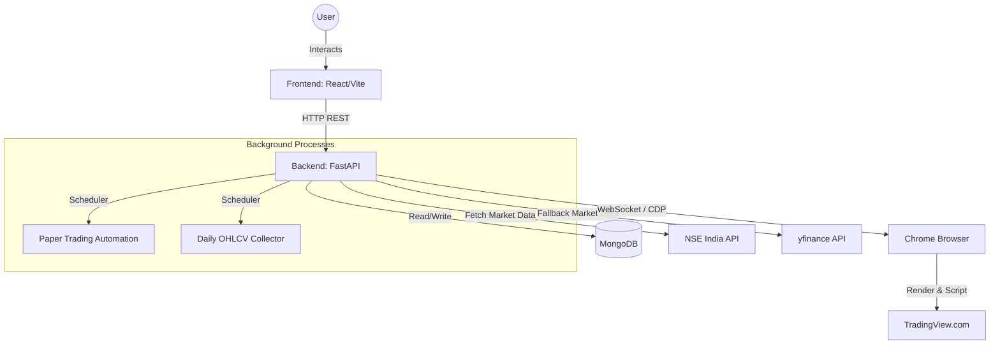

# Project Overview: Trading Agent

## 1. Executive Summary

**What this project is:**
The Trading Agent is a comprehensive automated system designed for scanning, scoring, and trading stocks in the Indian Stock Market (NSE). It evaluates stocks based on predefined Swing and Momentum strategies. The system is currently running exclusively in **Paper Trading Mode** to ensure stability, safety, and strategy validation before any real capital is risked.

**What problem it solves:**
Manual stock screening, strategy evaluation, and position sizing are time-consuming and prone to emotional biases. This project automates the entire pipeline: from fetching market data and identifying high-probability setups to verifying technicals on TradingView and managing risk-adjusted paper trades automatically.

**Primary objectives:**
- Automate market data collection from the NSE (National Stock Exchange).
- Score 750+ stocks daily for Swing and Momentum setups.
- Use TradingView as a visual and data validation layer via Chrome DevTools Protocol (CDP).
- Simulate live trading via an automated paper trading engine with strict risk management.
- Generate and collect historical datasets for future AI model training.

---

## 2. Project Architecture

The project follows a standard Client-Server architecture with a decoupled React frontend and an async Python backend, backed by MongoDB. 

**High-level architecture:**
- **Frontend:** A React Single Page Application (SPA) built with Vite that provides a dashboard, stock screening results, paper trade tracking, and system health monitoring.
- **Backend:** A FastAPI Python server that exposes REST endpoints, runs background schedulers, handles data fetching, and computes trading logic.
- **Database:** A local MongoDB instance used for storing market data snapshots, historical OHLCV, paper trade states, and system logs.
- **TradingView Integration:** The backend uses the Chrome DevTools Protocol (CDP) to attach to an active browser session, navigate to TradingView, set symbols and timeframes, and extract underlying chart data (candles) to confirm setups.



**Folder Structure:**
- `backend/`: Python FastAPI application, containing routes, services, AI integration scripts, and core trading logic.
- `frontend/`: React frontend source code (`src/App.jsx`, API clients, CSS).
- `scripts/`: PowerShell automation scripts for starting/stopping the application.
- `logs/`: Application log files.

---

## 3. Technologies Used

**Programming Languages:**
- Python 3 (Backend)
- JavaScript / JSX (Frontend)

**Frameworks & Libraries:**
- **Backend:** FastAPI, Motor (Async MongoDB), requests, websockets, yfinance.
- **Frontend:** React 18, Vite.

**Databases:**
- MongoDB (Async Motor driver)

**External APIs & Tools:**
- **NSE India:** Public endpoints for market quotes and index constituents.
- **yfinance:** Yahoo Finance API for fallback historical data and missing fields.
- **TradingView:** Used via browser automation (Chrome DevTools Protocol on port `9222`) to extract real-time technical indicators and OHLCV data.

---

## 4. Core Features

### Market Data Scanning
- **What it does:** Fetches real-time or end-of-day quotes for all symbols in a defined index (e.g., `NIFTY TOTAL MARKET`). 
- **How it works:** Queries NSE endpoints. If fields are missing (or if the NSE blocks the request), it falls back to `yfinance` to fill in the gaps.
- **Why it exists:** Provides the foundational raw data needed to filter and score 750+ stocks.

### Strategy Scoring
- **What it does:** Calculates a score out of 100 for each stock based on two main strategies: Swing and Momentum.
- **How it works:** Uses mathematical bands to score metrics like price strength, relative volume, 30-day momentum, and proximity to the day's high/low.
- **Why it exists:** Highlights the top actionable candidates for the day without manual chart screening.

### TradingView Confirmation
- **What it does:** Automatically opens a stock chart on TradingView, sets the correct timeframe, and extracts candle data to validate the setup.
- **How it works:** Uses `websockets` to connect to Chrome's debugging port (`9222`). It injects JavaScript (`Runtime.evaluate`) to interact with the `window.TradingViewApi`.
- **Why it exists:** Ensures that the backend logic is confirmed by actual chart data (preventing false positives from bad exchange data) and extracts indicator values like ATR and EMA.

### Paper Trading Automation
- **What it does:** Manages a virtual portfolio. It enters trades based on confirmed plans, monitors active positions, takes partial profits at Targets (T1, T2, T3), and triggers Stop Losses.
- **How it works:** A background scheduler runs periodically during market hours to compare real-time prices against the entry/exit levels of open paper trades.
- **Why it exists:** Allows the strategy to be forward-tested in real market conditions without financial risk.

---

## 5. Trading Logic

### Strategies Overview
- **Swing Trading:** Focuses on stocks breaking out or bouncing near support over a multi-day to multi-week timeframe. Looks for strong 30-day momentum and high relative volume. (Timeframes: `1D`, `1W`)
- **Momentum Trading:** Focuses on explosive, high-liquidity moves over shorter timeframes. Rejects extended stocks to prevent buying the top. (Timeframes: `1H`, `4H`, `1D`)

### Entry & Exit Conditions
- **Entry:** Triggered when the current price breaches the confirmed entry level from the Trade Plan.
- **Exit (Stop Loss):** 
  - Swing: 1.75x ATR or below recent weekly support.
  - Momentum: 1.25x ATR or below the EMA20.
- **Exit (Take Profit):** Scaled out at predefined targets (T1, T2, T3) based on R-multiples of the initial risk.

### Risk Management
- **Account:** Starts with a configurable virtual balance (default: ₹250,000) and leverage (2.5x).
- **Position Sizing:** Trades are graded (A+, A, B, C). Higher grades allow a higher percentage of the portfolio to be risked (e.g., A+ allows 0.50% risk, B allows 0.25%).
- **Margin Limit:** A maximum percentage of total capital can be deployed to prevent over-leveraging.

---

## 6. Code Structure

### Backend Modules
- **`main.py`**: The FastAPI application entry point, middleware configuration, and router initialization.
- **`config.py`**: Environment variable parsing, validation, and global settings initialization.
- **`data_provider.py` & `nse_client.py`**: Handles all external HTTP requests to NSE and yfinance, including rate-limit handling and error redaction.
- **`scoring.py`**: Pure, stateless functions that compute the Swing and Momentum scores based on OHLCV inputs.
- **`tv_client.py`**: The Chrome DevTools Protocol manager. Connects to Chrome, manages TradingView tabs, and executes injected JS.
- **`tv_confirmation.py`**: Validates the candles extracted by `tv_client.py` (checks for missing candles, weird gaps) and generates Trade Plans.
- **`services/paper_automation.py`**: Background tasks for updating the state of open paper trades.

### Frontend Modules
- **`src/App.jsx`**: The main React component that handles routing (via state), UI layout, and rendering tables/dashboards.
- **`src/api.js`**: Axios/Fetch wrappers for communicating with the FastAPI backend.

### Execution Flow
1. User clicks **"Score Market Data"**.
2. Frontend calls `/api/market/load-all`.
3. Backend fetches data via `nse_client.py`, scores it via `scoring.py`, and saves to MongoDB.
4. User clicks **"Confirm"** on a high-scoring stock.
5. Frontend calls `/api/swing/tv-confirm`.
6. Backend uses `tv_client.py` to open the chart in Chrome, extracts ATR/EMA, generates a Paper Plan, and saves it.

---

## 7. Configuration

Configuration is managed in `backend/config.py` using environment variables with sensible defaults.

**Key Parameters:**
- `PAPER_MODE` (Default: `True`): Ensures no real orders are placed.
- `LIVE_TRADING_ENABLED` (Default: `False`): Master kill-switch for live broker API usage.
- `TRADINGVIEW_DEBUG_PORT` (Default: `9222`): Port used to communicate with Chrome.
- `DATABASE_NAME` (Default: `trading_agent_clean`): MongoDB database name.
- `STARTING_VIRTUAL_BALANCE`: Initial capital for the paper trading portfolio.
- `GRADE_RISK_PERCENT_A_PLUS`: Max portfolio risk allowed for top-tier setups.

---

## 8. External Integrations

- **TradingView (via Chrome):** The backend does not use a direct TradingView API. Instead, it expects Google Chrome to be running with `--remote-debugging-port=9222`. It attaches to the browser, opens a tab to TradingView, and extracts data from the DOM/JS context.
- **NSE India:** Web scrapes public endpoints for live quotes. Highly prone to rate-limiting and layout changes.
- **yfinance:** Used as a fallback data source when the NSE API fails or returns incomplete data.
- **MongoDB:** A local MongoDB server (typically on port 27017) is required for state persistence.

---

## 9. Installation and Setup

### Prerequisites
1. **Python 3.10+**
2. **Node.js 18+**
3. **MongoDB Community Server** (running locally on port 27017).
4. **Google Chrome** (must be closed and relaunched with debugging enabled).

### Installation Steps
1. **Clone the repository.**
2. **Backend Setup:**
   ```powershell
   cd backend
   python -m venv .venv
   .\.venv\Scripts\activate
   pip install -r requirements.txt
   ```
3. **Frontend Setup:**
   ```powershell
   cd frontend
   npm install
   ```
4. **Browser Setup:**
   Close all Chrome instances. Run Chrome from the terminal with:
   ```powershell
   chrome.exe --remote-debugging-port=9222
   ```

### Running the Project
Use the provided PowerShell script in the root directory:
```powershell
.\start-trading-agent.ps1
```
This will launch both the FastAPI backend (on port 8011) and the React frontend (on port 5173).

---

## 10. Current State

- **Completed Features:** Market scanning, fallback data providers, Swing/Momentum scoring, TradingView automation via CDP, Trade Plan generation, Paper Trading Dashboard, and automated paper trade management.
- **Known Bugs / Quirks:** 
  - The TradingView CDP connection can sometimes timeout if the browser is minimized or sleeping.
  - NSE API occasionally rate-limits the scraper heavily, requiring yfinance fallbacks.
- **Safety:** The project is strictly locked in **Paper Mode**. There are no broker APIs integrated.

---

## 11. Future Improvements

- **Broker Integration:** Implement an interface for live brokers (e.g., Zerodha, Upstox) once the paper trading strategy proves profitable over a 6-month period.
- **AI Integration:** Feed historical datasets (currently being collected by the Daily OHLCV Collector) into an ML model to replace or augment the hardcoded scoring logic.
- **Headless Browser:** Move away from requiring an active desktop Chrome window to using headless Playwright or Puppeteer for TradingView extraction, improving reliability.
- **Dockerization:** Containerize the backend, frontend, and MongoDB for easier deployment.

---

## 12. Developer Guide

### How to add new features
1. **Backend Route:** Add a new router in `backend/routes/` and include it in `main.py`.
2. **Business Logic:** Keep complex logic in `backend/services/`. Do not put heavy logic in route handlers.
3. **Frontend API Wrapper:** Expose the new endpoint in `frontend/src/api.js`.
4. **UI:** Add the necessary components in `frontend/src/App.jsx`.

### Coding Conventions
- **Backend:** Use Python type hints extensively. Use asynchronous programming (`async/await`) for all I/O bound tasks (MongoDB, network requests).
- **Frontend:** Use functional components and React Hooks. 
- **Error Handling:** Catch expected exceptions and return standardized HTTP responses. Unhandled exceptions are caught by the global exception handler in `main.py`.

### Common Pitfalls
- **TradingView Disconnects:** If the user closes the TradingView tab or Chrome entirely, the backend will throw `TradingViewTabDisconnectedError`. The code is designed to auto-recover by opening a new tab, but this slows down the pipeline.
- **Timezones:** NSE operates in IST, TradingView charts might default to local timezones, and the backend stores timestamps in UTC. Always use the timezone utilities in `data_provider.py` and `timestamps.py` when comparing dates.

---

## 13. File-by-File Explanation

### Backend
- **`main.py`**: Initializes the FastAPI app, configures CORS, handles global exceptions, and mounts routers.
- **`config.py`**: Validates environment variables and defines system limits (e.g., max leverage, risk percentages).
- **`scoring.py`**: Contains `score_swing_row` and `score_momentum_row`. Pure math functions; no side effects.
- **`data_provider.py`**: Orchestrates data fetching. Defines the fallback logic (NSE -> yfinance).
- **`tv_client.py`**: Contains the `TradingViewClient` class. Connects to `localhost:9222/json` to find tabs, establishes a WebSocket, and sends CDP commands like `Page.navigate` and `Runtime.evaluate`.
- **`tv_confirmation.py`**: Consumes `tv_client.py`. Ensures the chart has stabilized, checks for missing candles/gaps, calculates ATR, and formats the output into a structured Trade Plan.
- **`services/paper_automation.py`**: Contains the loop that monitors active paper trades, updates current prices, and triggers Take Profits or Stop Losses.

### Frontend
- **`package.json` & `vite.config.js`**: React dependencies and Vite bundler configuration.
- **`src/App.jsx`**: A massive monolithic React file handling state for all dashboard tabs (Swing, Momentum, Paper Trades, System Health).
- **`src/api.js`**: Centralized Axios/Fetch definitions for all backend communication.

---

## 14. Data Flow

1. **Input (Scanning):** 
   - A cron job or manual UI click triggers a market scan.
   - `nse_client.py` scrapes NSE. If data is missing, `data_provider.py` patches it using `yfinance`.
2. **Processing (Scoring):**
   - The raw data is passed through `scoring.py`. Each stock receives a Swing and Momentum score.
   - Results are saved to the `market_data` MongoDB collection.
3. **Validation (TV Confirmation):**
   - The user selects a high-scoring stock.
   - `tv_client.py` forces Chrome to navigate to the stock's TradingView chart.
   - `tv_confirmation.py` extracts the candles, calculates ATR, and generates Entry/StopLoss/Target levels.
4. **Execution (Paper Trading):**
   - The validated plan is saved as a "Paper Trade".
   - `paper_automation.py` continuously checks real-time prices against the paper trade levels and updates the trade state (e.g., `ACTIVE` -> `TARGET_1_HIT`).

---

## 15. Frequently Asked Questions

**Q: Why is live trading disabled?**
A: Live trading involves real financial risk. The system must first prove its profitability and technical stability in Paper Mode for several months. Additionally, no broker APIs have been implemented yet.

**Q: Why use Chrome DevTools Protocol instead of a direct TradingView API?**
A: TradingView does not offer a public API for extracting raw chart data and indicator values for individual users. CDP allows the agent to scrape the DOM and JS context of an authenticated user's browser, bypassing these restrictions.

**Q: The market scan is failing with "RATE_LIMITED". What do I do?**
A: The NSE frequently rate-limits aggressive scrapers. The system will automatically fall back to `yfinance`. If you need fresh NSE data, wait a few minutes and try again.

**Q: How do I change the risk percentage for trades?**
A: Modify the `GRADE_RISK_PERCENT_*` variables in `backend/config.py`.

---

## 16. Glossary

- **ATR (Average True Range):** A technical indicator that measures market volatility. Used in this project to set dynamic Stop Losses.
- **CDP (Chrome DevTools Protocol):** A protocol that allows external tools to instrument, inspect, debug, and profile Chromium-based browsers.
- **EMA (Exponential Moving Average):** A type of moving average that places a greater weight on the most recent data points.
- **OHLCV:** Open, High, Low, Close, Volume. The standard format for financial chart data.
- **Paper Trading:** Simulated trading that allows investors to practice buying and selling without risking real money.
- **R-Multiple:** A measure of risk/reward. 1R represents the initial amount risked on a trade. T1 at 2R means taking profit when the gain is twice the initial risk.
- **Swing Trading:** A strategy that attempts to capture gains in a stock over a period of a few days to several weeks.
- **Momentum Trading:** A strategy that looks to capitalize on the continuance of existing trends in the market.
