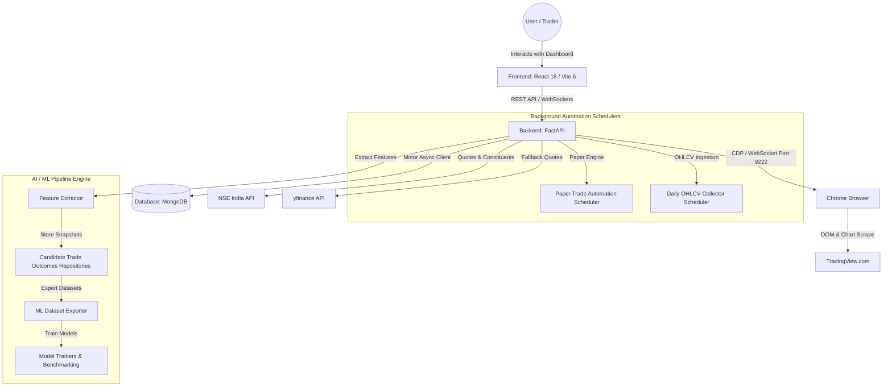

# Trading Agent & Stock Recommendation

A comprehensive automated system designed for scanning, scoring, and trading stocks in the Indian Stock Market (NSE India). The system evaluates candidates using predefined **Swing** and **Momentum** strategies, extracts multi-timeframe chart technicals via browser automation (Chrome DevTools Protocol), simulates risk-managed paper trades, and builds ML-ready historical datasets for AI outcome evaluation.

---

## Project Status

- **Development Mode**: `PAPER_TRADING_ONLY` (Live broker execution is disabled by default for safety).
- **Current Development Branch**: `ml-data-phase` (Contains the latest ML dataset exporter, candidate trade outcome evaluator, historical market repositories, and model training framework).
- **Test Suite Status**: 1,111 backend unit/integration tests verified passing (1,111 passed, 0 failed, 0 errors).

---

## Overview

The Trading Agent automates the end-to-end stock evaluation pipeline for 750+ NSE India equities:

1. **Market Data Scanning**: Fetches real-time and end-of-day market data from NSE India API, with `yfinance` fallback.
2. **Strategy Scoring**: Ranks symbols out of 100 based on Swing (breakouts, moving averages, relative volume) and Momentum (30-day velocity, proximity to highs) algorithms.
3. **TradingView Confirmation**: Automates Chrome via Chrome DevTools Protocol (CDP) to navigate TradingView charts, extract multi-timeframe candles (1W, 1D, 4H, 1H), and calculate technical trade plans (Entry, Stop Loss, Target Ladder).
4. **Paper Trading Engine**: Simulates trade execution, position sizing, margin allocation (1.5% margin cap, ₹30,000 max capital per trade, 2.5x leverage), stop loss invalidation, and PnL tracking.
5. **AI / ML Pipeline**: Generates feature snapshots, aggregates candidate trade outcomes (CTO), exports historical datasets, and trains predictive models to evaluate trade setup quality.

---

## Architecture

The project follows a decoupled client-server architecture with a React SPA frontend, an async FastAPI backend, a local MongoDB database, and a headless/remote Chrome CDP bridge for TradingView chart extraction.



---

## Repository Structure

```text
Trading-agent-and-Stock-recommendation/
├── backend/                         # FastAPI application & core services
│   ├── ai/                          # ML feature extraction, dataset loading, model training
│   ├── cli/                         # Command-line tools (dataset export, model training, backfills)
│   ├── docs/                        # Backend technical specifications & schemas
│   ├── routes/                      # REST API endpoint handlers (AI, Market, Paper, Scan, Swing, etc.)
│   ├── services/                    # Business logic (Paper engine, ML pipeline, CDP manager, position sizing)
│   ├── tests/                       # Complete pytest suite (1,111 tests)
│   ├── utils/                       # Shared utility functions (symbol normalization)
│   ├── config.py                    # Centralized settings & environment configuration
│   ├── database.py                  # MongoDB async lifecycle connection manager
│   ├── data_provider.py             # Hybrid NSE + yfinance market data aggregator
│   ├── main.py                      # Backend entry point & FastAPI application factory
│   └── nse_universe.py              # NSE constituent list definitions (750+ symbols)
├── frontend/                        # React frontend application
│   ├── src/                         # React components, dashboard UI, API clients, styling
│   ├── index.html                   # HTML template
│   ├── package.json                 # Frontend dependencies & scripts
│   └── vite.config.js               # Vite bundler configuration
├── datasets/                        # ML dataset export directory (CSV ignored, JSON manifests committed)
│   └── dataset_manifest_v1.0.0.json # Tracked dataset manifest metadata
├── models/                          # Trained model directory (.joblib binaries ignored, JSON manifest committed)
│   └── training_manifest.json       # Tracked model training manifest
├── scripts/                         # Operational PowerShell automation scripts
│   ├── start-trading-agent.ps1      # Launcher script
│   ├── status-trading-agent.ps1     # Process health checker
│   └── stop-trading-agent.ps1       # Shutdown script
├── AI_PROJECT_INDEX.json            # Architecture & database collection registry index
├── ARCHITECTURE_DECISIONS.md        # Technical architecture decision records (ADRs)
├── BUG_DATABASE.md                  # Known bug tracking log
├── ENGINEERING_DECISIONS_LOG.md     # Detailed engineering decision log
├── FEATURE_HISTORY.md               # Timeline of system feature additions
├── PROJECT_MASTER_DOCUMENTATION.md  # Comprehensive technical specification document
├── PROJECT_OVERVIEW.md              # High-level system overview
├── REPOSITORY_MAP.md                # Component-to-file mapping
└── historical_market_data_design.md # Historical sync architecture documentation
```

---

## Backend

The backend is built with **FastAPI** (Python 3) using **Motor** for non-blocking MongoDB interactions.

### Main Modules & Services:
- **Entry Point**: `backend/main.py`
- **Settings & Config**: `backend/config.py`
- **Database Connection**: `backend/database.py`
- **Data Providers**: `backend/data_provider.py`, `backend/nse_universe.py`
- **TradingView CDP Automation**: `backend/tv_client.py`, `backend/tv_confirmation.py`, `backend/services/tradingview_manager.py`
- **Paper Trading Engine**: `backend/services/paper_sync.py`, `backend/services/paper_orchestrator.py`, `backend/services/position_sizing.py`, `backend/services/capital_accounting.py`
- **AI / ML Pipeline Services**: `backend/services/ml_pipeline.py`, `backend/services/ml_outcome_evaluator.py`, `backend/services/ml_dataset_exporter.py`, `backend/services/candidate_trade_outcomes_service.py`

### API Routes:
- `/api/ai/*` — Feature preview, outcome attachment, model status (`backend/routes/ai.py`)
- `/api/market/*` — Market data quotes, sector performance, universe scanning (`backend/routes/market.py`)
- `/api/paper/*` — Paper trade lifecycle, order approvals, execution runs, account balance (`backend/routes/paper.py`)
- `/api/scan/*` — Real-time strategy setup screening (`backend/routes/scan.py`)
- `/api/swing/*`, `/api/momentum/*` — Strategy-specific setup evaluation (`backend/routes/swing.py`, `backend/routes/momentum.py`)
- `/api/outcomes/*` — Candidate trade outcome metrics (`backend/routes/outcomes.py`)

---

## Frontend

The frontend is a single-page React 18 application built with **Vite 6** and Vanilla CSS.

- **Entry Point**: `frontend/src/main.jsx`
- **Main Dashboard Component**: `frontend/src/App.jsx`
- **API Client**: `frontend/src/api.js`
- **AI Helpers**: `frontend/src/aiDataset.js`
- **Styles**: `frontend/src/App.css`

The dashboard provides real-time tabs for setup scanning (Swing/Momentum), TradingView CDP trigger management, active paper trades, trade journal history, account virtual capital performance, and AI feature dataset controls.

---

## AI / ML Pipeline

The AI/ML subsystem evaluates trading setups by measuring forward market outcomes and training predictive models:

1. **Feature Extraction** (`backend/ai/features.py`): Generates technical features (RSI, ATR ratios, moving average distances, volume spikes) and market context indicators.
2. **Candidate Trade Outcomes (CTO)** (`backend/services/candidate_trade_outcomes_service.py`): Evaluates setup execution over N-day forward windows (Max Favorable Excursion, Max Adverse Excursion, Target Hit vs Stop Hit).
3. **ML Dataset Exporter** (`backend/services/ml_dataset_exporter.py`): Exports cleaned, label-attached tabular datasets to `datasets/`.
4. **Model Trainers & Benchmarking** (`backend/ai/model_trainers.py`, `backend/ai/benchmarking.py`): Trains and benchmarks classification/regression models to rank high-conviction trade setups.

### CLI Tools:
- Export ML dataset: `python -m backend.cli.export_ml_dataset`
- Train models: `python -m backend.cli.train_models`
- Evaluate trade outcomes: `python -m backend.cli.eval_candidate_trade_outcomes`
- Upgrade CTO records: `python -m backend.cli.upgrade_candidate_trade_outcomes`

---

## Data Architecture

Primary MongoDB database collections (`trading_agent_clean`):

| Collection | Description |
| :--- | :--- |
| `market_data` | Live and cached market quotes per symbol |
| `historical_ohlcv` | Daily OHLCV candle historical storage |
| `scored_candidates` | Daily Swing and Momentum strategy evaluation scores |
| `swing_tv_confirmations` | TradingView CDP extraction outputs for Swing setups |
| `momentum_tv_confirmations` | TradingView CDP extraction outputs for Momentum setups |
| `paper_trades` | Active, waiting, completed, and stopped paper positions |
| `paper_update_runs` | Audit logs of paper update execution runs |
| `trade_journal` | Completed trade execution history & PnL metrics |
| `ai_feature_snapshots` | Point-in-time technical feature vectors |
| `candidate_trade_outcomes` | Forward-looking trade outcome evaluations |

---

## Paper Trading

The paper engine enforces strict institutional risk management rules:

- **Starting Virtual Balance**: ₹25,00,000.00
- **Leverage**: 2.5x
- **Margin Cap Per Trade**: 1.5% of balance (Max ₹30,000.00 capital per trade)
- **Portfolio Margin Limit**: 90%
- **Pre-Entry Stop Loss Status**: If price dips below stop loss before entry triggers, trade status becomes **`STOPPED`** (`STOP_LOSS_HIT_BEFORE_ENTRY`).
- **Mode**: Strictly virtual paper execution (`LIVE_TRADING_ENABLED = False`). Real brokerage API keys are neither required nor enabled.

---

## Historical Market Data

The historical market data architecture (`historical_market_data_design.md`) handles batch syncing of broad market universes (NSE 750+ symbols):

- **Repository**: `backend/services/historical_market_repository.py`
- **Sync Engine**: `backend/services/historical_sync_engine.py`
- **Daily Collector Scheduler**: Controlled via settings `DAILY_OHLCV_SCHEDULER_ENABLED`, `DAILY_OHLCV_SCHEDULER_TIME_IST`.

---

## Configuration

Settings are managed via `backend/config.py` using standard environment variables with safe defaults:

```env
# Backend & Server Settings
BACKEND_HOST=127.0.0.1
BACKEND_PORT=8011
FRONTEND_HOST=127.0.0.1
FRONTEND_PORT=5173

# Database Settings
MONGO_URI=mongodb://localhost:27017
DATABASE_NAME=trading_agent_clean

# Trading Engine Settings
LIVE_TRADING_ENABLED=false
PAPER_MODE=true

# TradingView CDP Connection
TRADINGVIEW_DEBUG_PORT=9222

# Background Scheduler Controls
PAPER_UPDATE_SCHEDULER_ENABLED=false
DAILY_OHLCV_SCHEDULER_ENABLED=false
```

---

## Installation

### Prerequisites
- **Python**: Version 3.10+ (Tested on Python 3.13.5)
- **Node.js**: Version 18+ (with `npm`)
- **MongoDB**: Community Server running locally on `localhost:27017`
- **Google Chrome**: (Optional, for TradingView CDP chart extraction on debug port 9222)

### 1. Setup Backend
```bash
# Set PYTHONPATH to include backend directory
$env:PYTHONPATH="backend"

# Install Python dependencies
pip install -r backend/requirements.txt
```

### 2. Setup Frontend
```bash
cd frontend
npm install
```

---

## Running the Application

### Option A: Using PowerShell Automation Scripts
```powershell
# Start both backend and frontend background processes
.\scripts\start-trading-agent.ps1

# Check status of running components
.\scripts\status-trading-agent.ps1

# Stop running processes
.\scripts\stop-trading-agent.ps1
```

### Option B: Manual Startup

**Backend Server**:
```bash
# From repository root (Windows PowerShell)
$env:PYTHONPATH="backend"
python backend/main.py
# Server starts on http://127.0.0.1:8011
```

**Frontend Dev Server**:
```bash
# From frontend directory
cd frontend
npm run dev
# Dashboard opens on http://127.0.0.1:5173
```

---

## Testing

The backend test suite is powered by `pytest` and `anyio`.

```bash
# Execute full backend test suite
$env:PYTHONPATH="backend"
python -m pytest backend/tests -p no:cacheprovider
```

- **Latest Verified Test Result**: **1,111 tests passed, 0 failed, 0 errors** (1,111 collected and verified).

---

## Build

To build the React frontend for production distribution:

```bash
cd frontend
npm run build
```
Production assets are generated in `frontend/dist/`.

---

## Data and Generated Artifacts

The following local artifacts and generated files are explicitly ignored by `.gitignore` and excluded from version control:

- Environment files: `.env`, `**/.env`
- Application log files: `*.log`, `logs/`
- Local database storage & dumps: `.mongo-data/`, `mongo_backups/`, `exports/`, `backups/`
- Generated ML datasets: `datasets/*.csv` *(Note: `datasets/dataset_manifest_v1.0.0.json` is committed)*
- Trained model binary weights: `models/*.joblib`, `models/feature_importance_*.json` *(Note: `models/training_manifest.json` is committed)*
- Frontend production build output: `frontend/dist/`
- Scratch directories & temporary test caches: `scratch/`, `.pytest_cache/`, `backend/pytest_temp/`

---

## Git Branches

- **`ml-data-phase`** *(Current Active Development Branch)*: Contains the latest ML dataset exporter, candidate trade outcome evaluator, historical market data repositories, and model training infrastructure.
- **`antigravity-wave2b`** *(Default / Baseline Branch)*: Stable baseline core trading and paper engine implementation.

---

## Development Guidelines

Refer to existing repository governance guidelines for code conventions and safety contracts:
- Architectural Guidelines: ARCHITECTURE_DECISIONS.md
- Development Log & Context: ENGINEERING_DECISIONS_LOG.md
- Code Conventions: `CODING_RULES.md`, `PROJECT_CONVENTIONS.md`

---

## Documentation Index

| File | Description |
| :--- | :--- |
| `AI_PROJECT_INDEX.json` | JSON registry of all system components, entry points, and DB collections |
| `PROJECT_MASTER_DOCUMENTATION.md` | Master technical documentation covering architecture, APIs, and data models |
| `PROJECT_OVERVIEW.md` | High-level executive overview of trading strategies, scoring, and CDP workflows |
| `ARCHITECTURE_DECISIONS.md` | Recorded technical architecture decision records (ADRs) |
| `ENGINEERING_DECISIONS_LOG.md` | Chronological log of engineering choices and system designs |
| `FEATURE_HISTORY.md` | Log of features introduced across project development iterations |
| `BUG_DATABASE.md` | Historical record of resolved bugs and edge-case fixes |
| `historical_market_data_design.md` | Architectural specification for historical data syncing and repositories |
| `backend/docs/paper_signals_schema.md` | Schema documentation for paper signals and trade states |

---

## Safety / Security

- **Strict Paper Trading Enforcement**: Real brokerage execution is disabled (`LIVE_TRADING_ENABLED = False`).
- **Zero Committed Credentials**: Environment configuration files (`.env`), API tokens, and local database connections are strictly kept local and ignored by `.gitignore`.

---

## Known Limitations

- **Browser Dependency for CDP**: TradingView chart extraction requires a running Google Chrome instance listening on remote debugging port `9222`.
- **Market Data Rate Limits**: Public NSE API endpoints may enforce rate limiting or require user-agent rotation; fallback to `yfinance` is automatically attempted when quotes are delayed or missing.

---

## Contributing

1. Maintain isolated, modular FastAPI routes and services.
2. Ensure any schema additions or paper trade status logic updates pass the full `pytest` suite without weakening existing risk assertions.
3. Keep generated `.csv` datasets and `.joblib` model binaries local; only update `.json` manifests in `datasets/` and `models/`.

---

## License

License: Not currently specified in the repository.

---

## Final Notes

This repository provides a modular, risk-managed platform for Indian Stock Market quantitative screening, paper trading, and machine learning dataset collection. All strategy components and API endpoints are verified via automated unit and integration testing.
