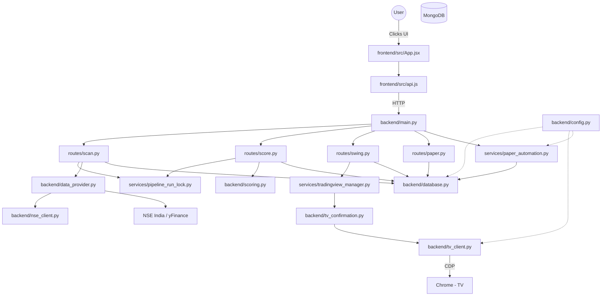

# Repository Map: Trading Agent

This document provides a comprehensive mapping of every critical file in the Trading Agent repository. It serves as an architectural compass for AI assistants and human developers to understand responsibilities, safety constraints, and dependency flows.

---

## 1. Root Backend Core

### `backend/main.py`
- **Purpose**: The FastAPI application entry point. Bootstraps the server, mounts routers, and manages startup/shutdown events.
- **Dependencies**: `config.py`, `database.py`, `services/paper_automation.py`, `routes/*`.
- **Imported by**: None (Run directly by Uvicorn).
- **Criticality**: High.
- **Safe to modify?**: Yes (for adding new routes/middleware).
- **Typical reasons to edit**: Mounting a new API router or adding CORS domains.
- **Common mistakes**: Blocking the event loop in a middleware.
- **Complexity**: Low.
- **Category**: Infrastructure.

### `backend/config.py`
- **Purpose**: Pydantic BaseSettings definition. Reads `.env` and validates types.
- **Dependencies**: `pydantic`.
- **Imported by**: Almost every file in the backend.
- **Criticality**: High.
- **Safe to modify?**: Yes.
- **Typical reasons to edit**: Adding a new feature flag or tuning default risk percentages.
- **Common mistakes**: Not adding a fallback/default for a new variable.
- **Complexity**: Low.
- **Category**: Configuration.

### `backend/database.py`
- **Purpose**: Singleton manager for the Motor AsyncIOMotorClient.
- **Dependencies**: `motor.motor_asyncio`, `config.py`.
- **Imported by**: All `routes/*` and `services/*` that perform DB I/O.
- **Criticality**: High.
- **Safe to modify?**: No (unless changing core DB auth).
- **Typical reasons to edit**: Modifying connection pool limits.
- **Common mistakes**: Instantiating multiple clients instead of reusing the singleton.
- **Complexity**: Low.
- **Category**: Infrastructure.

### `backend/scoring.py`
- **Purpose**: Pure mathematical evaluation of stocks based on OHLCV. Defines `A+`, `A`, `B` grades.
- **Dependencies**: None.
- **Imported by**: `routes/score.py`.
- **Criticality**: High.
- **Safe to modify?**: No (modifying ruins the historical backtest continuity).
- **Typical reasons to edit**: Tweaking algorithmic weights.
- **Common mistakes**: Raising exceptions on edge-case data instead of returning a `NO_TRADE` status.
- **Complexity**: Medium.
- **Category**: Business Logic.

### `backend/data_provider.py` & `backend/nse_client.py`
- **Purpose**: Fetches real-time and historical quotes from the NSE. Implements fallback to yfinance.
- **Dependencies**: `requests`, `yfinance`, `asyncio`.
- **Imported by**: `routes/scan.py`.
- **Criticality**: High.
- **Safe to modify?**: Yes (frequent fixes needed due to NSE rate limits).
- **Typical reasons to edit**: Adapting to NSE API schema changes.
- **Common mistakes**: Not handling HTTP 429 Too Many Requests.
- **Complexity**: Medium.
- **Category**: Infrastructure.

### `backend/tv_client.py`
- **Purpose**: Direct Chrome DevTools Protocol (CDP) WebSocket client.
- **Dependencies**: `websockets`, `json`, `asyncio`.
- **Imported by**: `backend/tv_confirmation.py`, `services/tradingview_manager.py`.
- **Criticality**: High.
- **Safe to modify?**: No.
- **Typical reasons to edit**: Updating injected JS to match TradingView UI updates.
- **Common mistakes**: Causing race conditions by ignoring JSON-RPC message IDs.
- **Complexity**: High.
- **Category**: Infrastructure.

### `backend/tv_confirmation.py`
- **Purpose**: Bridges `tv_client.py` to business logic. Validates gaps, missing candles, and extracts ATR.
- **Dependencies**: `tv_client.py`, `services/risk_reward_targets.py`.
- **Imported by**: `routes/swing.py`, `routes/momentum.py`.
- **Criticality**: High.
- **Safe to modify?**: Yes (but with caution).
- **Typical reasons to edit**: Adjusting the ATR multiplier for Stop Losses.
- **Common mistakes**: Ignoring timezone differences between TV and local server.
- **Complexity**: High.
- **Category**: Business Logic.

---

## 2. API Routes (`backend/routes/`)

### `backend/routes/scan.py`
- **Purpose**: Endpoint to trigger NSE scraping and save raw data.
- **Dependencies**: `data_provider.py`, `database.py`, `services/pipeline_run_lock.py`.
- **Criticality**: Medium.
- **Safe to modify?**: Yes.

### `backend/routes/score.py`
- **Purpose**: Endpoint to run `scoring.py` over the `market_data` collection.
- **Dependencies**: `scoring.py`, `database.py`.
- **Criticality**: Medium.
- **Safe to modify?**: Yes.

### `backend/routes/paper.py`
- **Purpose**: Endpoints to fetch, create, and sync paper trades.
- **Dependencies**: `database.py`, `services/paper_sync.py`.
- **Criticality**: High.
- **Safe to modify?**: Yes.

### `backend/routes/dashboard.py`
- **Purpose**: Aggregates equity curves and open positions for the React UI.
- **Dependencies**: `database.py`.
- **Criticality**: Low.
- **Safe to modify?**: Yes.

*(Other route files follow the identical pattern of validating HTTP input and delegating to services).*

---

## 3. Services (`backend/services/`)

### `backend/services/tradingview_manager.py`
- **Purpose**: A LoopSafeAsyncLock singleton that prevents concurrent API routes from stealing the TradingView WebSocket.
- **Dependencies**: `asyncio`, `threading`.
- **Imported by**: `routes/swing.py`, `routes/momentum.py`.
- **Criticality**: High.
- **Safe to modify?**: No.
- **Typical reasons to edit**: Debugging locking timeouts.
- **Common mistakes**: Introducing deadlocks by improperly catching exceptions inside lock contexts.
- **Complexity**: High.
- **Category**: Infrastructure / Utils.

### `backend/services/paper_automation.py`
- **Purpose**: Asynchronous infinite loop scheduler that monitors open trades and triggers Take Profit / Stop Loss.
- **Dependencies**: `database.py`, `services/paper_sync.py`.
- **Imported by**: `main.py` (during `lifespan`).
- **Criticality**: High.
- **Safe to modify?**: Yes (carefully).
- **Typical reasons to edit**: Adjusting the polling interval (`SYNC_INTERVAL_SECONDS`).
- **Common mistakes**: Putting synchronous blocking code in the loop.
- **Complexity**: Medium.
- **Category**: Business Logic.

### `backend/services/pipeline_run_lock.py`
- **Purpose**: MongoDB-backed distributed lock to ensure heavy tasks (like `scan` or `score`) only run once globally.
- **Criticality**: Medium.
- **Safe to modify?**: Yes.
- **Complexity**: Medium.

---

## 4. Frontend (`frontend/src/`)

### `frontend/src/App.jsx`
- **Purpose**: The entire React application (Dashboard, Swing, Momentum, Settings).
- **Dependencies**: React `useState`, `useEffect`.
- **Imported by**: `main.jsx`.
- **Criticality**: High.
- **Safe to modify?**: Yes.
- **Typical reasons to edit**: Adding new data columns, tweaking CSS classes, adding a new dashboard tab.
- **Common mistakes**: Missing `key` props in the massive tables, causing severe render lag.
- **Complexity**: High (due to file size).
- **Category**: UI.

### `frontend/src/api.js`
- **Purpose**: Axios/Fetch abstraction for all API calls to FastAPI.
- **Dependencies**: `fetch`.
- **Imported by**: `App.jsx`.
- **Criticality**: Medium.
- **Safe to modify?**: Yes.
- **Category**: Infrastructure.

---

## 5. Overall Dependency Graph

## AI Navigational Cheat Sheet

- **If you are asked to fix a "Rate Limit" bug**: Go to `backend/data_provider.py` and implement better yfinance fallbacks.
- **If you are asked to change how much capital is risked**: Go to `backend/config.py`.
- **If you are asked to modify when a stock is considered "A+"**: Go to `backend/scoring.py`.
- **If you are asked to fix the UI tables not updating**: Go to `frontend/src/App.jsx` and trace the `setInterval` API polling logic.
- **If you are asked to fix a "TradingView Disconnected" bug**: Read `backend/services/tradingview_manager.py` to see why the lock wasn't freed, and `backend/tv_client.py` for WebSocket dropouts.
